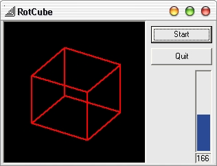



## Spinning 3D Cube in pure VB

### Description

This code spins a 3d cube without directX! It uses pure VB and High School Algebra II math. Please vote or comment about this code.
 
### More Info
 

             |
---                |---
**Submitted On**   |2002-05-09 17:05:14
**By**             |[Spinflip](https://github.com/Planet-Source-Code/PSCIndex/blob/master/ByAuthor/spinflip.md)
**Level**          |Intermediate
**User Rating**    |4.8 (24 globes from 5 users)
**Compatibility**  |VB 6\.0
**Category**       |[Graphics](https://github.com/Planet-Source-Code/PSCIndex/blob/master/ByCategory/graphics__1-46.md)
**World**          |[Visual Basic](https://github.com/Planet-Source-Code/PSCIndex/blob/master/ByWorld/visual-basic.md)
**Archive File**   |[Spinning\_381393592002\.zip](https://github.com/Planet-Source-Code/spinflip-spinning-3d-cube-in-pure-vb__1-34623/archive/master.zip)

